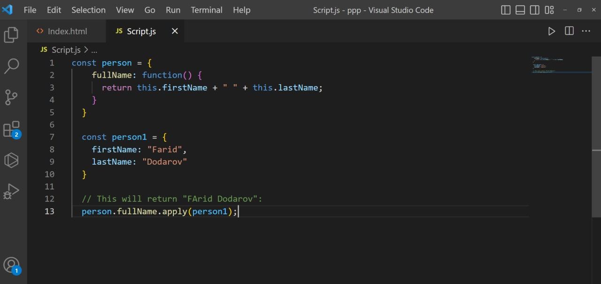

# Object
JavaScript object is a nonprimitive data-type that allows 
you to store multiple 
collections of data

# Object Methods
The Object.entries() method returns an array of a given 
object's own enumerable string-keyed property [key, 
value] pairs.

# Keys Method
The Object.keys() method returns an array of a given 
object's own enumerable property names, iterated in 
the same order that a normal loop would

# Values Method
The Object.values() method returns an array of a given 
object's own enumerable property values

# Destructuring and spread – Destructuring
The destructuring assignment syntax is a JavaScript expression that makes it 
possible to unpack properties from object, into distinct variables

# Destructuring and spread– spread
The spread operator ... is used to 
expand or spread an to make it 
works with own enumerable 
properties of an object. 
For example:

You can use the spread 
operator to clone the own 
enumerable properties of an 
object.

# This
The behavior of the this keyword in JavaScript is
somewhat different from its comparison with religious
languages. 
There are also differences in collection in strict and nonstrict mode.
this is not a variable. It is a keyword. 
You cannot change the value of this
In JavaScript, the this keyword refers to an object.
Which object depends on how this is being invoked (used or called).
The this keyword refers to different objects depending on how it is used

# bind()
With the bind() method, an object can borrow a method from another object.
This example creates 2 objects (person and member).
The member object borrows the fullname method from the person object:
JavaScript Function bind()
This example creates 2 objects 
(person and member).
The member object borrows the 
fullname method from person:
Hege Nilse

# apply()
The apply() method calls the specified function with a given this value, 
and arguments provided as an array

# call ()
The call() method calls the function with a given this value and
arguments provided individually.
